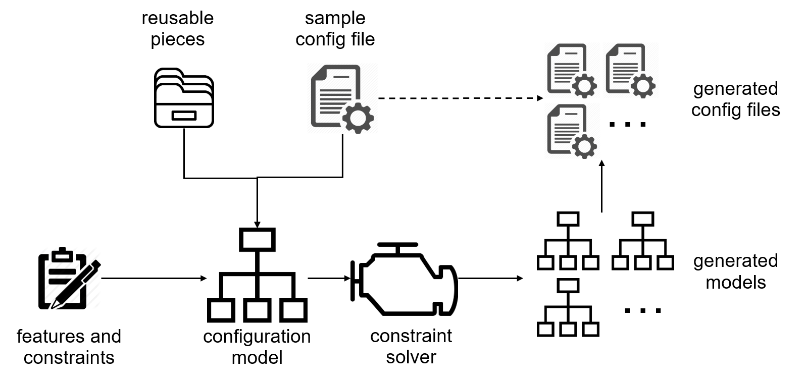
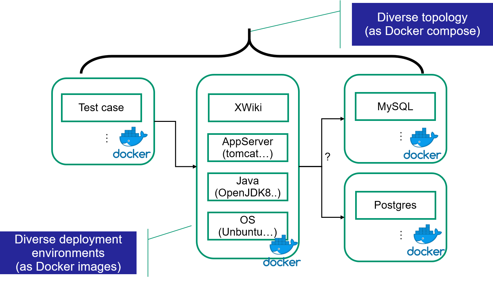

## Table of contents
  - [What is CAMP?](#what-is-camp)
  - [Quick start](#quick-start)
  - [How does CAMP work?](#how-does-camp-work)
  - [CAMP Input/Output](#camp-input-output)
  - [Examples](#examples)
  - [Running CAMP on your project](#running-camp-on-your-project)

## What is CAMP?
CAMP (Configuration AMPlification) takes as input a sample testing configuration and generates automatically a number of diverse configurations. The generation is guided by predefined features and constraints, and utilizes a set of reusable pieces. The current version of CAMP is focused on the Docker environment, and the input and output configurations are specified as Dockerfiles or docker-compose files.

## Quick start
To get start, you need to copy the current repository:
```
git clone https://github.com/STAMP-project/camp 
```
Once copied, go to the docker folder to build a image that contains the tool:
```
cd docker/
docker build -t camp-tool:latest .
```
To run the tool, please go to the samples folder:
```
cd samples/stamp/xwiki
docker run -it -v $(pwd):/root/workingdir camp-tool:latest /bin/bash start.sh
```
The tool should produce four folders ```samples/xwiki/compose1```, ```samples/xwiki/compose2```, ```samples/xwiki/compose3```, ```samples/xwiki/compose3```. Each folder contains a docker compose file which is a result of the amplification of the source compose file in ```samples/xwiki/docker-compose/docker-compose.yml```

## How does CAMP work
CAMP extracts from the input Docker specifications an abstract configuration model, and tries to synthesize new models based on the features, variables and constraints. The figure below illustrates the approach:

The new models will then be translated back into Docker specifications. These specifications can be executed in the same way as the original input, and therefore to replace the original testing configuration during either the manual testing or in a continuous integration pipeline.

## CAMP Input/Output
The input to CAMP comprises two parts, i.e., the sample configuration and the scope definition. The sample configuration, in the current set up, are Docker specifications, i.e., docker files and docker-compose files. A docker-compose file defines the architecture of a testing set-up, consisting of components for the application, the testing client, or the supportive services such databases. A docker file defines how to build an image from a base one. Each of these components maps to a docker service in the docker-compose specification. The application itself may consist of multiple components, especially following a micro-service architecture. Each docker service corresponds to an docker image. A docker image can be either directly downloaded (pulled) from a docker repository, such as the Docker Hub, or built locally. In the latter case, the CAMP users should provide a docker file which defines how to build the image from a base one. If there are multiple images to be built locally, or an image can be built in alternative ways, the users should provide multiple docker files.

CAMP outputs a set of specifications, docker files, and docker-compose files.
- ```camp/samples/stamp/xwiki/out/genimages.yml``` defines a chain of rules to evaluate to build new docker images
- ```camp/samples/stamp/xwiki/out/ampimages.yml``` lists docker images with labels to generate
- ```camp/samples/stamp/xwiki/out/ampcompose.yml``` lists docker-compose files to build from the template
- ```camp/samples/stamp/xwiki/build/``` contains folder with generated docker files
- ```camp/samples/stamp/xwiki/build/build.sh``` is a script to build images from generated docker files

## Examples
In the samples directory of the repository, there are two examples. 

In the first example, we have set up CAMP to test an open-source project XWiki. XWiki is an ultimate wiki platform to facilitate collaborative process inside any organization. XWiki can be in principle set up in various environments and various configurations. CAMP provides means to capture this variations in environment and configurations, generate those different environments and configurations. CAMP also facilitates testing against those generated configurations.

In the second example, CAMP is set up against a CityGo application by ATOS. CityGo can be set up in various environments and configurations. In this example, we demonstrate how CAMP can vary not just elements which map to docker images and services, but also arbitrary parameters and commands in docker files.


### XWiki
To execute CAMP on XWiki.
```
git clone https://github.com/STAMP-project/camp 
cd camp/docker/ && docker build -t camp-tool:latest .
cd ../samples/stamp/xwiki/ && docker run -it -v $(pwd):/root/workingdir camp-tool:latest /bin/bash start.sh
```
This should generate four folders, i.e. ```camp/samples/stamp/xwiki/compose1, camp/samples/stamp/xwiki/compose2, camp/samples/stamp/xwiki/compose3, camp/samples/stamp/xwiki/compose4```. Each folder contains four docker-compose files which set up XWiki differently. Possible options are on the picture below.

XWiki can run on different application servers, different version of java, and can be hooked up to various DBs. These variations are captured in ```camp/samples/stamp/xwiki/features.yml```
```
java:
  openjdk: [openjdk9, openjdk8]
appsrv:
  tomcat: [tomcat7, tomcat8, tomcat85, tomcat9]
db:
  mysql: [mysql8, mysql5]
  postgres: [postgres9, postgres10]
xwiki: [xwiki9mysql, xwiki9postgres, xwiki8mysql, xwiki8postgres]
```
We call these possible variations - features, e.g. the feature ```java``` contains a sub-feature, which in return contains other features, i.e. ```openjdk8```, ```openjdk9```. To build docker files from a feature selection, we need to define rules. Those rules are found in ```camp/samples/stamp/xwiki/images.yml```. See below:
```
downloadimages:
  OpenJdk8:
    features: [openjdk8]
    name: openjdk
    tag: 8
...
buildingrules:
  Tomcat7:
    requires: [java]
    adds: [tomcat7]
  Xwiki8Postgres:
    requires: [tomcat]
    adds: [xwiki8postrgres]
    depends: [postrgres]
...
``` 
CAMP evaluates and chains such rules. A chain results in a valid selection of the features and compliance to constraints and the meta-model of CAMP. Each rule corresponds to a docker image. A chain of the rules stacks a set of images onto each other yielding a new image. A valid chain may look as follows (chains are generated by CAMP and could be found in ```/camp/samples/stamp/xwiki/genimages.yml```):
```
- chain:
  - {rule: Xwiki8Postgres}
  - {rule: Tomcat7}
  - {name: openjdk, tag: 8}
  features: [tomcat7, openjdk8, xwiki8postgres]
```
An execution of the above chain would result in a new image. CAMP takes a docker image from ```camp/samples/stamp/xwiki/repo/Tomcat7/``` and substitutes the from statement with ```FROM openjdk:8``` yielding a new image called ```tomcat7:openjdk-8```. A docker file for the image is located in ```camp/samples/stamp/xwiki/repo/build/tomcat7--openjdk-8```. Further, CAMP takes another docker image in ```camp/samples/stamp/xwiki/repo/Xwiki8Postgres/``` and substitutes ```FROM tomcat:8-jre8``` with ```tomcat7:openjdk-8```. This generates a new docker image ```xwiki8postgres:tomcat7-openjdk-8``` in ```camp/samples/stamp/xwiki/repo/build/xwiki8postgres--tomcat7-openjdk-8```. Therefore, CAMP generates the new image which good be used to test XWiki in different configurations, e.g. Tomcat 7, openjdk8, Postgres. Depending on defined constraints, CAMP can generate multiple images. In the given example, CAMP creates 8 new images. Each image gives us a **diverse deployment environment**.

To generate a **diverse topology**, CAMP requires ```camp/samples/stamp/xwiki/composite.yml``` as follows:
```
services:
  web:
    imgfeature: [xwiki]
    mandatory: true
  mysql:
    imgfeature: [mysql]
  postgres:
    imgfeature: [postgres]
images:
  Postgres9: {name: postgres, tag: "9", features: [postgres9]}
  ...
constraints:
  - Not(services['mysql'].alive() == services['postgres'].alive())
...
``` 
The file defines a skeleton for a docker-compose file, the file represents 150% model, which contains all possible services. We also associate each service with a feature, e.g. ```web``` is associated with ```xwiki```. We also define rules in the ```image``` section, e.g. ```Postgres9``` realizes the ```postgres9``` feature. The images is built from a default image with the label ```postgres:9```. We also define a constraint which postulates that we cannot have mysql and postgres in the same docker-compose file. Each service is filled with data from the ```/camp/samples/stamp/xwiki/docker-compose/docker-compose.yml```, where ```image``` is substituted with **diverse deployment environment**, e.g. ```xwiki8postgres:tomcat7-openjdk-8``` realizes the feature ```xwiki``` and therefore, the image implements the ```web``` service. The ```postgres:9``` image realizes the feature ```postgres``` and therefore, it implements the service ```postgres```. In the given example, CAMP generates four different docker-compose files by varying the services in ```camp/samples/stamp/xwiki/composite.yml``` and generated **diverse deployment environment**s

### CityGo
To execute CAMP on CityGo.
```
git clone https://github.com/STAMP-project/camp 
cd camp/docker/ && docker build -t camp-tool:latest .
cd ../samples/stamp/atos/ && docker run -it -v $(pwd):/root/workingdir camp-tool:latest /bin/bash allinone.sh
``` 
CAMP generates two various configurations. Each configuration tweaks parameters of the apache server. The meta-model of CAMP specifies variables. The variable is an abstraction which allows specifying arbitrary modifications of docker files. In the given example, we modify parameters of the docker-compose file in ```camp/samples/stamp/atos/docker-compose/docker-compose.yml```. In CityGo there are two variables in ```camp/samples/stamp/atos/images.yml```.
```
...
buildingrules:
  Showcase:
    requires: [python]
    adds: [showcase]
    svar: [ThreadLimit, ThreadPerChild]
    depends: [postgres]
...
```
```ThreadLimit``` defines a thread limit and ```ThreadPerChild``` specifies a number of threads per child. These parameters are set for the backend of the CityGo application. The file ```camp/samples/stamp/atos/variables.yml``` specifies these variable and possible values as follows.
```
ThreadLimit:
  ThreadLimit32:
    type: Int
    value: 128 
    operations:
      - substituion1:
          engine: regexp
          filename: "docker-compose.yml"
          placement: "ThreadLimit=64"
          replacement: "ThreadLimit=128"
ThreadPerChild:
  ThreadPerChildFree:
    type: Int
    operations:
      - substituion1:
          engine: regexp
          filename: "docker-compose.yml"
          placement: "ThreadsPerChild=25"
          replacement: "ThreadsPerChild=${value}"
...
```
In the example, each variable has one possible value, which does not have to be the case. For each value, we have the ```operations``` section. This section defines how a value should be realized. In the given example, CAMP needs to perform a substitution operation on the text file (```docker-compose.yml```). We replace ```ThreadLimit=64``` with ```ThreadLimit=128```. We also specify ```type``` and ```value```, which could be used by CAMP to define a proper value. We can also leave it up to CAMP to decide a value, and then we just use a placeholder which should be filled in, e.g. ```ThreadsPerChild=${value}```. CAMP decides values by evaluating application constraints set up in ```camp/samples/stamp/atos/composite.yml```. To perform changes in docker file, CAMP builds a product model by evaluating constraints. The product model contains a list of references to docker-compose files and list of variables with values to realize to yield final compose files. You can find more examples with product and realization models in ```/camp/modules/camp-realize/```


## Running CAMP on your project
### Overview
To set CAMP on your project. There are two prerequisites:
* Your project should be dockerised.
* New configuration of the project can be achieved by:
..* By substituting the FROM statement of a Dockerimage file
..* By substituting an image of a docker-compose file

Further, we need to identify variation points of your configuration, e.g., java versions. We fill out feature.yml with this information. We also need to define building rules which are used to build new docker files. This information is filled in images.yml file. This allows generating various docker files which are various possible configuration of your application. If we need to generate various docker-compose file, we need to fill in compose.yml. However, this is optional. 
