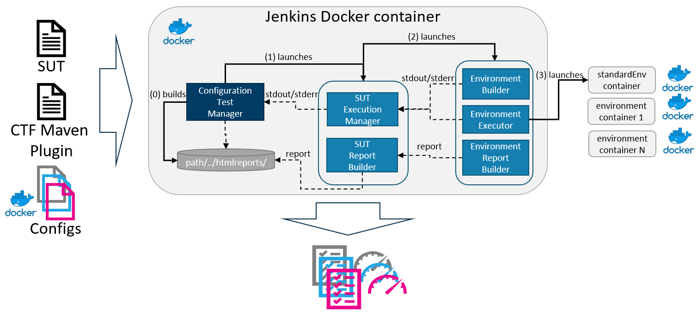

# Test Configuration Executor (TECOR)
TECOR is a prototype tool to execute test cases against multiple configurations. The tool can be integrated into existing continious delivery pipeline og can be run from a command line.


TECOR executes test cases by delegating testing to dedicated executors each of which is run in a separate docker container. Thereafter, results are collected by TECOR and published as an accumulated report. TECOR expects 
- a system under test (SUT) - a directory to the folder where TECOR locates the source code of the tool to test
- an executor pluging - a directory to the plugin to build and test a SUT, e.g. TECOR Maven Plugin. TECOR Maven Plugin copies the source code of the SUT to the environment defined in the config folder, builds each environment, builds the SUT using maven in the given environment, executes test cases in this environment, and reports results of the test executions back to TECOR.
- configs - a directory to the folder with various configurations. Each configuration is a docker file that defines the environment that should be build to test the SUT.
The output of the tool is a report that contains all results of the execution of the test cases against different configurations.

## Setting up TECOR in Jenkins
For more details, see [installation](https://github.com/STAMP-project/tecor/blob/master/testframework/docs/installation.pdf)

## Setting up testing in TECOR
To set up TECOR to test a SUT against various configurations once have to update testframework/config.ini
```sh
[system_under_test]
system_under_test = ../xwiki-platform/xwiki-platform-distribution/xwiki-platform-distribution-flavor/xwiki-platform-distribution-flavor-test/xwiki-platform-distribution-flavor-test-misc
exe_plugin = ../exe_plugins/maven
env_list = ../environments/xwiki-platform-trivial
```
- `system_under_test` - a directory with a SUT.
- `exe_plugin` - a directory with location of the plugin to build and test the SUT.
- `env_list` -  a directory with configurations. 

In the given example, the SUT in a module of XWiki, the executor plugin is maven in `../exe_plugins/maven` and configurations are in `../environments/xwiki-platform-trivial`. All directories are relative to `config.ini`, e.g. if tecor is in `~/tecor`, the `exe_plugin` is in `~/tecor/testframework/../exe_plugin/maven`.

## Running TECOR from CLI
You can alos run TECOR from the command line:
```sh
./deploy.sh
```
Thes script will set up TECOR and executes test cases of XWiki against several configurations. The script makes several assumptions:
- source code of XWiki is located in the directory `../xwiki-platform which` which is relative to `deploy.sh`
- docker gid is 998
- there is a directory ~/tmp/testing_report where TECOR will put a consolidated report the execution of the test cases for xwiki


