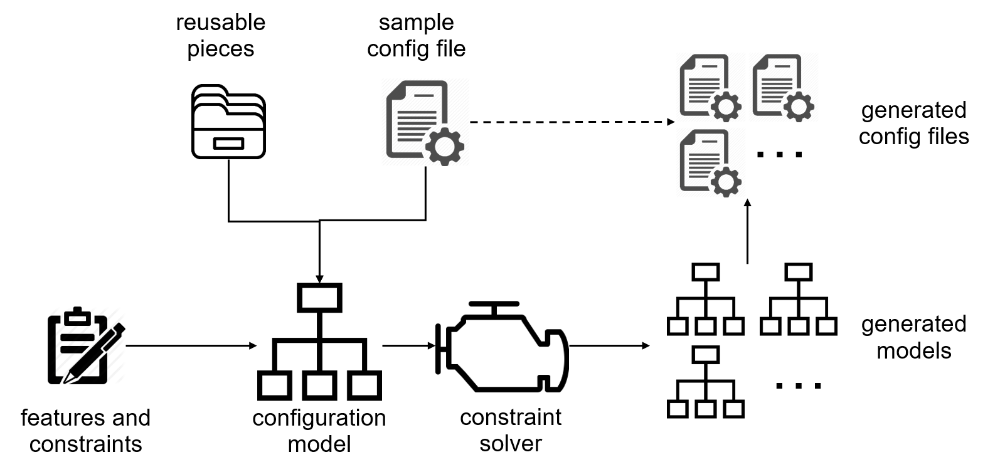

# What is CAMP?
CAMP (Configuration AMPlification) takes as input a sample testing
configuration and generates automatically a number of diverse
configurations. The generation is guided by predefined features and
constraints, and utilizes a set of reusable pieces. The current
version of CAMP is focused on the Docker environment, and the input
and output configurations are specified as Dockerfiles or
docker-compose files.

## Quick start
The fastest way to start with CAMP is to use our [pre-built Docker
image](https://hub.docker.com/r/fchauvel/camp/), using the following
command:

```bash
$> docker run -it -v $(pwd):/camp/workspace fchauvel/camp:latest camp generate -d workspace
```

Alternatively, you can fetch [the source
code](https://github.com/STAMP-project/camp) and install it according
to [the instructions](pages/setup.html).

Here are the three main CAMP commands:

 * `camp generate ... ` to generate alternative test configurations from a seeds
 * `camp realize ... ` to concretize variables into these test configurations
 * `camp execute ...` to run some of these new test configurations


### CAMP Inputs 

CAMP requires two inputs:

 1. The **CAMP Model**, which is a YAML file that describes the pieces
   that can vary in the orchestrations. These may be service
   providers, feature providers, version or other numerical
   configurations.
   
 2. A **template** orchestration that illustrates how the components
    listed in the CAMP model are bound and configured together. So
    far, CAMP only supports the Docker technologies and the
    orchestration must be a docker-compose file.
 
From there, CAMP will generate, realize and execute alternative
configurations, each with alternative variations.


## Examples

In the samples directory of the repository, there are two examples,
[XWiki](pages/xwiki.html) and [CityGo](pages/citygo.html).

 * In [XWiki](pages/xwiki.html), we have set up CAMP to test XWiki, a
   wiki platform to facilitate collaborative process inside any
   organization. XWiki can be set up in various environments and
   various configurations. CAMP provides means to capture this
   variations and generate those different environments and
   configurations. CAMP also facilitates testing against those
   generated configurations.

 * In [CityGo](pages/citygo.html), CAMP is set up against the CityGo
   application by ATOS. CityGo can be set up in various environments
   and configurations. In this example, we demonstrate how CAMP can
   vary not just elements which map to docker images and services, but
   also arbitrary parameters and commands in docker files.


## How does CAMP work?

CAMP extracts from the input Docker specifications an abstract
configuration model, and tries to synthesize new models based on the
features, variables and constraints. The figure below illustrates the
approach:  The
new models will then be translated back into Docker
specifications. These specifications can be executed in the same way
as the original input, and therefore to replace the original testing
configuration during either the manual testing or in a continuous
integration pipeline.
